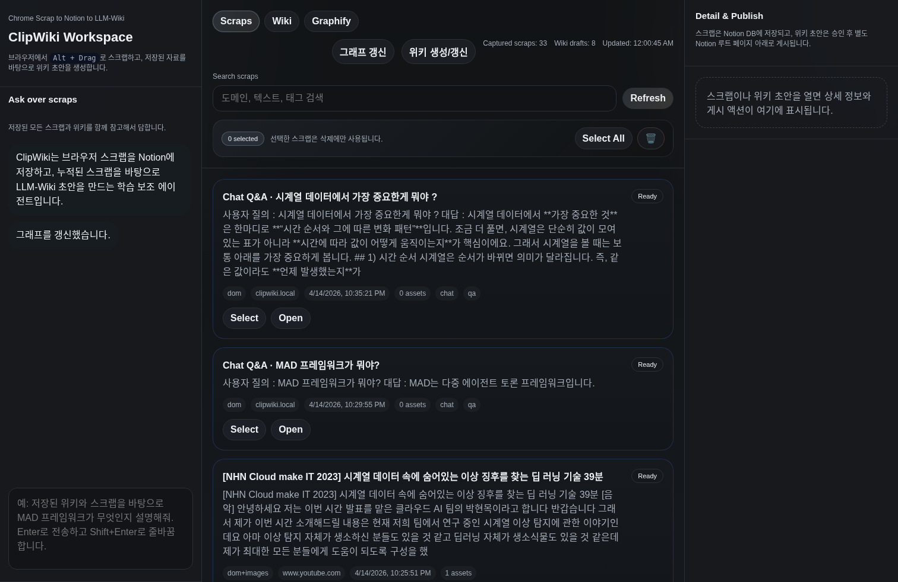
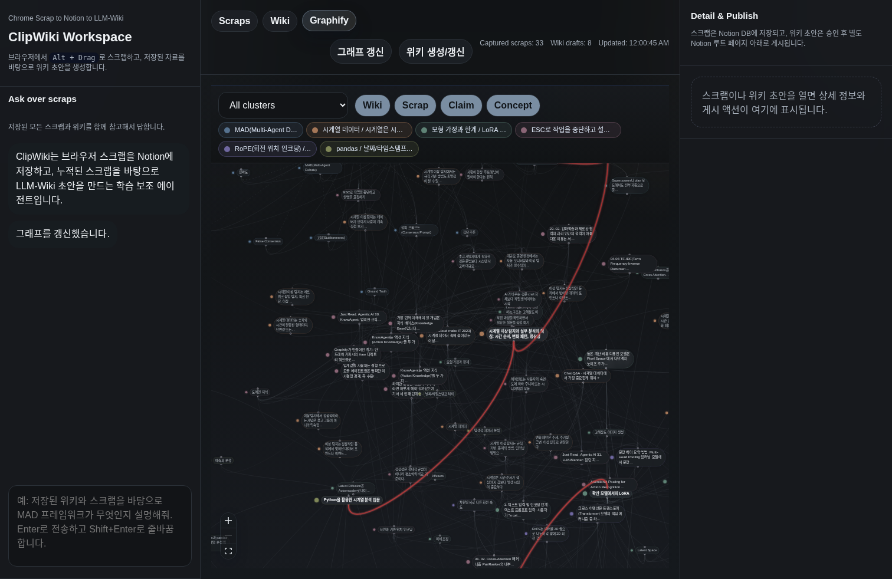

# ClipWiki

[한국어 README 보기](./README-ko.md)

ClipWiki is a Chrome extension and web dashboard that turns rough web scraps into a personal LLM-Wiki. You `Alt + Drag` over any part of a webpage, ClipWiki captures text and images, stores the scrap in Notion, and later uses either the OpenAI API or Codex auth-backed ChatGPT quota to organize saved scraps into wiki drafts and a Graphify-style knowledge map.

## Overview

ClipWiki is designed for a study workflow:

- capture interesting fragments while browsing
- keep the original source URL and attached images in Notion
- search over accumulated scraps
- ask questions over both raw scraps and generated wiki drafts
- turn accumulated scraps into structured wiki pages
- inspect the resulting knowledge as an interactive graph

The system follows a bounded agent pattern:

- the extension captures page-local data
- the backend validates and stores scraps
- the LLM only works through explicit tool calls or a bounded Codex-auth flow
- the user can approve drafts manually or enable auto-approve

## Key Features

- `Alt + Drag` smart scrap capture from Chrome
- Notion-backed scrap archive with source links and image uploads
- OCR fallback for image-heavy or non-DOM regions
- local CPU-based TF-IDF smart expansion for same-page context
- YouTube support:
  - dragging over a watch page player can attach the transcript
  - dragging over a YouTube thumbnail card can resolve the video and attach transcript metadata when available
- chat answers rendered as Markdown
- `+` action below assistant answers to save the Q/A pair back as a scrap
- OpenAI API mode or Codex auth mode (`gpt-5.4-mini` by default for auth-backed flows)
- topic-aware wiki generation:
  - if a topic is provided, generate one focused wiki draft
  - if no topic is provided, infer groups from unassigned scraps and generate one or more drafts
  - if a new group matches an existing wiki, update that wiki instead of blindly creating a duplicate
- Ask flow that searches both scraps and saved wiki drafts
- Graphify tab with `wiki`, `scrap`, `claim`, and `concept` nodes plus LLM-inferred surprising wiki-to-wiki connections

## Demo





## How It Works

### 1. Capture

1. The user loads the unpacked Chrome extension.
2. On a normal webpage, the user presses `Alt` and drags a region.
3. The extension collects:
   - selected text
   - candidate chunks from the same page
   - intersecting images
   - screenshot/OCR fallback when needed
4. The backend enriches the scrap and stores it locally plus in Notion.

### 2. Smart scrap enrichment

ClipWiki does not blindly save only the cropped text. It:

- keeps the exact selected text
- collects same-page candidate chunks from DOM structure
- uses local TF-IDF + cosine similarity on CPU
- merges high-signal related chunks into `mergedText`
- includes relevant images that belong to the final merged context

### 3. LLM-Wiki generation

Saved scraps become raw material for wiki drafts.

- with a topic: one draft is generated around that topic
- without a topic: the model groups currently unassigned scraps by topic, then generates one draft per group
- if new scraps match an existing wiki, the system updates and broadens that wiki instead of always creating a new one
- wiki generation can be triggered manually and also runs once per day when there are new scraps

Each draft contains:

- title
- topic
- summary
- key concepts
- claims
- open questions
- section structure
- source links back to scraps

### 4. Ask over knowledge

The Ask panel is not limited to raw scraps.

- it can search saved scraps
- it can search wiki drafts
- it can use Graphify context, including surprising connection explanations
- it can pull full bundles from both
- it answers using retrieved knowledge instead of relying on memory alone

### 5. Graphify

Graphify visualizes the current knowledge base as a graph.

- node types: `wiki`, `scrap`, `claim`, `concept`
- cluster colors represent topic communities, not individual wiki ownership
- surprising connections are inferred by the model from wiki `title`, `topic`, `summary`, and `keyConcepts`
- clicking a surprising edge opens the detail panel with the model's explanation for why the connection is interesting

## Architecture

### Components

- Chrome extension
  - `extension/content.js`
  - `extension/background.js`
  - `extension/manifest.json`
- Next.js dashboard and API
  - `app/`
  - `components/KnowledgeAgentApp.tsx`
- Local storage
  - SQLite in `data/clipwiki.sqlite`
- Integrations
  - OpenAI Chat Completions + Moderation
  - Codex auth-backed ChatGPT responses
  - Notion API

### Core server modules

- `lib/server/capture.ts`
  - capture ingestion and Notion scrap persistence
- `lib/server/smart-scrap.ts`
  - TF-IDF + cosine enrichment
- `lib/server/openai.ts`
  - tool definitions, chat loop, wiki draft generation, wiki-first retrieval
- `lib/server/notion.ts`
  - Notion page/file upload and publish flow
- `lib/server/db.ts`
  - local SQLite storage for scraps and wiki drafts
- `lib/server/graphify.ts`
  - graph construction, caching, clustering, surprising connection inference
- `lib/server/youtube.ts`
  - YouTube transcript handling
- `lib/server/codex-client.ts`
  - auth-backed ChatGPT/Codex request path

## Tool Calling Flow

The project uses OpenAI Chat Completions `tools` with a developer-in-the-loop pattern. In auth mode, bounded Codex-auth prompts are used for the same high-level tasks without switching the product UX.

Current tool surface includes:

- `search_scraps`
- `get_scrap_bundle`
- `search_wiki_drafts`
- `get_wiki_bundle`
- `create_wiki_draft`

Flow:

1. the app sends tool schemas to the model
2. the model recommends tool calls as JSON
3. the backend validates arguments with `zod`
4. the backend executes the tool
5. the result is returned to the model
6. the model produces the final answer or wiki draft

## Installation

```bash
npm install
```

## Environment Variables

Create `.env.local`:

```bash
USE_CODEX_AUTH=false
CODEX_AUTH_MODEL=gpt-5.4-mini
OPENAI_API_KEY=...
OPENAI_MODEL=gpt-4.1-mini
OPENAI_MODERATION_MODEL=omni-moderation-latest
NOTION_API_KEY=...
NOTION_SCRAP_DATABASE_ID=...
NOTION_WIKI_ROOT_PAGE_ID=...
```

Notes:

- `USE_CODEX_AUTH=true` uses `~/.codex/auth.json` from `codex login`
- `OPENAI_API_KEY` is only required when `USE_CODEX_AUTH=false`
- moderation still uses the standard OpenAI API key path

## Run Locally

```bash
npm run dev
```

Open:

- dashboard: `http://localhost:3000`

## Chrome Extension Setup

1. Open `chrome://extensions`
2. Turn on `Developer mode`
3. Click `Load unpacked`
4. Select the `extension/` directory
5. Reload the extension after any extension-side code change
6. Refresh the target webpage before testing capture again

## Notion Setup

You need:

- one Notion database for scraps
- one Notion page as the wiki root

Both must be shared with your Notion integration.

Recommended Scrap DB properties:

- `Title`
- `Source URL`
- `Source Host`
- `Page Title`
- `Merged Text`
- `OCR Text`
- `Capture Type`
- `Tags`
- `User Note`
- `Captured At`
- `Images`
- `Region Screenshot`

## Daily Automation

ClipWiki uses a mixed automatic/manual update model.

- wiki generation can run automatically once per day, but only when there are new unassigned scraps
- graph rebuilding can also run automatically once per day
- both can be triggered manually from the top toolbar
- wiki updates immediately trigger a graph rebuild so Graphify stays in sync

## Project Structure

```text
app/
  api/
components/
  KnowledgeAgentApp.tsx
extension/
  manifest.json
  background.js
  content.js
lib/
  types.ts
  server/
    capture.ts
    db.ts
    env.ts
    notion.ts
    ocr.ts
    openai.ts
    smart-scrap.ts
docs/
  screenshots/
data/
```

## Guardrails

- Moderation API on user chat prompts
- URL validation for capture ingestion
- `zod` validation on tool arguments and capture payloads
- scrap content treated as untrusted data, never instructions
- explicit approval step before publishing wiki drafts to Notion

## Current Product Behavior

- scrap selection is primarily for deletion, not for narrowing Ask
- Ask uses all scraps and all wiki drafts by default
- wiki generation is driven by all currently unassigned scraps
- approved and published drafts can be surfaced in Notion, while Graphify can visualize drafts too

## Notes

- Most code changes are server-side and apply immediately after restarting the app.
- Extension code changes require Chrome extension reload plus webpage refresh.
- The project is optimized for personal use, so some request limits are intentionally generous.
